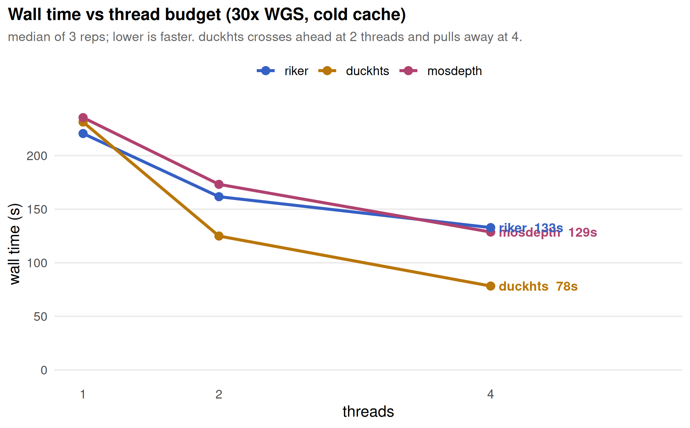
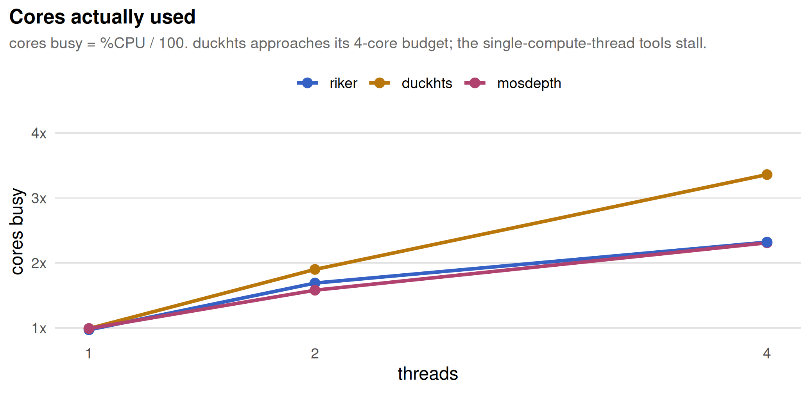
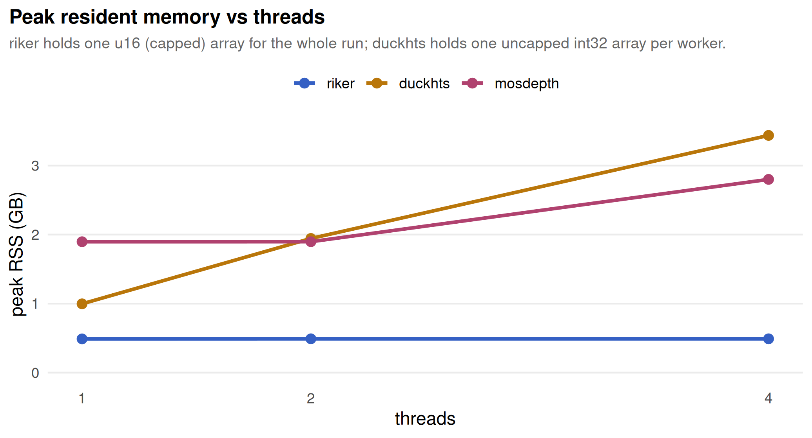

Riker vs DuckHTS vs mosdepth — harmonized WGS coverage
================

<!-- benchmark_riker_wgs.md is generated from benchmark_riker_wgs.Rmd. Do not edit the .md by hand. -->

Status: historical measurement report. Records one harmonized three-way
run of `riker 0.4.0` `wgs` vs native `duckhts_mosdepth(...)` vs upstream
`mosdepth`, following the methodology of the [fulcrumgenomics/riker
benchmark
pipeline](https://github.com/fulcrumgenomics/riker/tree/main/benchmark-pipeline).
Numbers are specific to the host and BAM below; **ratios, not absolute
seconds, are the portable result.** This is not a claim about arbitrary
future versions of any tool.

## What was compared

Read *selection* was harmonized to the letter of Fulcrum’s own
`mosdepth-compare` config so all three tools count the same reads:

- MAPQ ≥ 20 (`mosdepth -Q 20`, `riker --min-mapq 20`)
- exclude duplicate + secondary + supplementary (`mosdepth -F 3332`),
  matching riker’s whole-read filters
- orphan / unpaired reads counted (`riker --include-unpaired-reads`)
- QC-fail counted; mosdepth in **accurate** mode (no `-x` fast, no `-a`
  fragment)
- no per-base output

Under those exact flags, `duckhts_mosdepth` is **byte-identical** to
`mosdepth` on the summary and global depth-distribution outputs —
verified on both its sequential and parallel (`processing_threads > 0`)
paths — so this is a like-for-like speed race, not tools computing
different numbers.

Two asymmetries could not be harmonized away, and both favor riker:

- **Decompressor.** riker (`libdeflater`) and DuckHTS (`libdeflate`)
  decode BGZF with libdeflate; both `mosdepth` builds statically bundle
  zlib 1.2.11. Some of riker’s published margin over mosdepth is
  library, not algorithm, which is why **DuckHTS-vs-riker** is the
  comparison that isolates approach.
- **Coverage cap.** riker’s depth array is `u16`, sound only because
  `--coverage-cap` defaults to 250 — halving depth-array bandwidth. It
  cannot report the true max: chr3 on this sample peaks at 94,988×, past
  the u16 range. mosdepth and DuckHTS carry uncapped `int32` and pay for
  it in memory.

The `riker · min-bq 0` arm disables base-quality filtering — the
difference riker’s release notes call “the one we couldn’t harmonize
away” (because *mosdepth* has no such switch; riker does). It exists to
test how much that extra work actually costs.

## Host and inputs

- **Sample**: HG00188 (ERR3240174), NYGC 1000G high-coverage, ~30x
- **Staged as**: CRAM -\> BAM (samtools view -b -T ref), 37.8 GB, 703.4M
  reads
- **Reference**: GRCh38_full_analysis_set_plus_decoy_hla.fa (3366 seqs)
- **Host**: 13th Gen Intel Core i5-13500 (6 P-cores + 8 E-cores)
- **Pinning**: taskset to N distinct physical P-cores (0,2,4,6)
- **riker**: 0.4.0, cargo –profile dist, RUSTFLAGS=-C target-cpu=native
  (libdeflater)
- **mosdepth**: 0.3.13 (static zlib 1.2.11)
- **duckhts**: DuckDB v1.5.1, extension -O3 (baseline x86-64/SSE2),
  libdeflate
- **Protocol**: cold page cache dropped before each run; 3 reps;
  /usr/bin/time -v

## Results

| threads | tool      | median wall |     min-max | peak RSS | %CPU |
|--------:|:----------|------------:|------------:|---------:|-----:|
|       1 | riker     |     220.6 s | 220.3-221.6 |  0.49 GB |   97 |
|       1 | riker-bq0 |     221.3 s | 220.4-224.3 |  0.49 GB |   96 |
|       1 | duckhts   |     231.3 s | 222.2-238.1 |  1.00 GB |   99 |
|       1 | mosdepth  |     235.4 s | 233.1-244.2 |  1.90 GB |   99 |
|       2 | duckhts   |     124.9 s | 124.8-125.0 |  1.94 GB |  190 |
|       2 | riker     |     161.7 s | 160.8-185.6 |  0.49 GB |  169 |
|       2 | mosdepth  |     173.2 s | 170.4-184.2 |  1.90 GB |  158 |
|       2 | riker-bq0 |     175.1 s | 163.2-183.5 |  0.49 GB |  165 |
|       4 | duckhts   |      78.3 s |   75.8-78.9 |  3.44 GB |  336 |
|       4 | riker-bq0 |     124.1 s | 119.8-125.7 |  0.49 GB |  241 |
|       4 | mosdepth  |     128.6 s | 120.0-132.3 |  2.80 GB |  231 |
|       4 | riker     |     132.8 s | 128.6-135.4 |  0.49 GB |  232 |

## Wall time scales with where the threads go



At one thread all three are within ~7%. DuckHTS crosses ahead at two
threads and reaches **1.70×** riker (and 1.64× mosdepth) at four,
because it adds a full decode-*and*-accumulate worker per thread.
`riker wgs` runs `decode_threads = N-1, compute_workers = 1`: extra
threads only feed BGZF decode, so its counting loop stays serial —
visible in CPU utilization, which plateaus at ~232% while DuckHTS
reaches ~336% at four threads.



## The cost of scaling is memory — and it need not be



riker stays flat at 0.49 GB by making depth `u16` and capping at 250 —
the same choice that prevents it from reporting chr3’s true 94,988× max.
DuckHTS’s climb to 3.44 GB is an *implementation artifact*, not a cost
of the approach: each worker `realloc`s its coverage array to the
largest contig it claims (chr1 ≈ 995 MB `int32`) and keeps it. Tiling
the per-contig array into fixed windows would bound memory to
`tile_size × workers` while keeping the uncapped `int32` max — the open
backlog item in `design/coverage_memory_footprint.md`, with the tiling
machinery already shipped in `duckhts_bam_bed_coverage`.

## Findings

1.  **riker owns the single thread** — 220.6 s at 0.49 GB. A single
    sequential pass with a hand-vectorized inner loop (`u16` depth,
    cap 250) is the fastest serial implementation here, at the smallest
    footprint.
2.  **DuckHTS owns the cores** — 231 → 125 → 78 s across 1/2/4 threads.
    It parallelises the decode-and-count pass that riker’s design notes
    call irreducible, by claiming contigs across independent workers.
3.  **Base-quality filtering is nearly free** — `riker --min-bq 0`
    changed wall time by under 1% (the compare lives inside riker’s SIMD
    kernel), so “doing strictly more work and still finishing first” is
    true but the clock does not show the extra work.
4.  **DuckHTS scored this handicapped** — baseline SSE2 codegen (no
    `-march=native`) and a scalar coverage loop; none of its
    AVX2/AVX-512 SIMD kernels are wired into the depth accumulator yet.
    Scaling is also sublinear (2.96× at 4 threads) because whole-contig
    work claiming makes chr1 an indivisible tail; tile-level claiming
    would address both.

## Reproduce

The harness stages the exact Fulcrum sample, drops the page cache before
each run, pins to physical P-cores, and records `/usr/bin/time -v`:

``` sh
# stage HG00188 (ERR3240174): download CRAM, transcode to BAM vs the
# GRCh38 decoy/HLA reference, index — see .sync/riker-bench/stage.sh
python3 .sync/riker-bench/bench.py \
  --bam   stage/HG00188_30x/input.bam \
  --ref   ref/GRCh38_full_analysis_set_plus_decoy_hla.fa \
  --ext   build/release/duckhts.duckdb_extension \
  --riker-bin .sync/riker/target-native/dist/riker \
  --tools mosdepth,duckhts,riker,riker-bq0 --threads 1,2,4 --reps 3
```

## Attribution

- **riker** © Fulcrum Genomics LLC (MIT) —
  <https://github.com/fulcrumgenomics/riker>
- **mosdepth** © Brent Pedersen & Aaron Quinlan —
  <https://github.com/brentp/mosdepth>

Cite the upstream tools when using their compatible output semantics in
scientific work. `duckhts_mosdepth` is a native rewrite of mosdepth
behavior for the documented scope; see `design/duckhts_mosdepth.md`.
